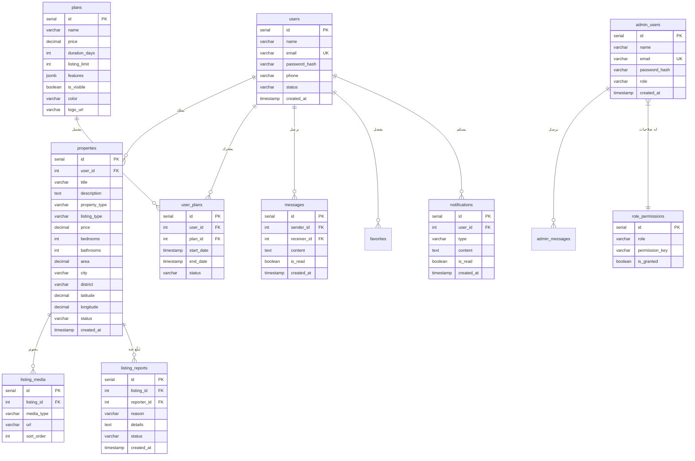

# Aqar Al-Jazeera V2 - Architecture Documentation
# توثيق بنية عقار الجزيرة V2

## System Architecture Diagram / مخطط بنية النظام


---

## Component Hierarchy / التسلسل الهرمي للمكونات

### Frontend Structure / بنية الواجهة الأمامية

```
frontend/
├── app/                              # Next.js App Router
│   ├── layout.tsx                    # التخطيط الرئيسي (Navbar, Footer)
│   ├── page.tsx                      # الصفحة الرئيسية
│   │
│   ├── (standalone)/                 # صفحات مستقلة
│   │   ├── admin-login/              # تسجيل دخول المديرين
│   │   └── request-access/           # طلب الانضمام
│   │
│   ├── admin/                        # لوحة تحكم الإدارة
│   │   ├── layout.tsx                # AdminShell
│   │   ├── dashboard/                # لوحة التحكم الرئيسية
│   │   ├── listings/                 # إدارة العقارات
│   │   ├── finance/                  # الإدارة المالية
│   │   ├── marketing/                # التسويق والتحليلات
│   │   ├── membership/               # إدارة العضويات
│   │   ├── messages/                 # رسائل العملاء
│   │   ├── reports/                  # البلاغات
│   │   ├── roles/                    # إدارة الصلاحيات
│   │   ├── support/                  # الدعم الفني
│   │   ├── users/                    # إدارة المستخدمين
│   │   ├── complaints/               # الشكاوى
│   │   ├── plans/                    # إدارة الباقات
│   │   └── news/                     # إدارة الأخبار
│   │
│   ├── listings/                     # صفحات العقارات
│   │   ├── page.tsx                  # قائمة العقارات
│   │   ├── [id]/                     # تفاصيل عقار
│   │   └── new/                      # إنشاء عقار جديد
│   │
│   ├── plans/                        # صفحة الباقات
│   ├── search/                       # البحث المتقدم
│   └── account/                      # حساب المستخدم
│
├── components/
│   ├── admin/                        # مكونات الإدارة
│   │   ├── AdminShell.tsx            # الغلاف الرئيسي
│   │   ├── AdminSidebar.tsx          # الشريط الجانبي
│   │   └── AdminTopbar.tsx           # الشريط العلوي
│   │
│   ├── ui/                           # مكونات واجهة المستخدم
│   └── sections/                     # أقسام الصفحات
│
└── lib/
    ├── stores/
    │   └── authStore.ts              # إدارة حالة المصادقة
    └── constants/
        └── planOptions.ts            # ثوابت الباقات
```

### Backend Structure / بنية الخادم

```
backend/
├── routes/                           # مسارات API
│   ├── auth.js                       # المصادقة وتسجيل الدخول
│   ├── listings.js                   # العقارات
│   ├── plans.js                      # الباقات
│   ├── membership.js                 # العضويات
│   ├── messages.js                   # رسائل المستخدمين
│   ├── admin-messages.js             # رسائل المديرين
│   ├── finance.js                    # الإدارة المالية
│   ├── marketing.js                  # التسويق
│   ├── notifications.js              # الإشعارات
│   ├── permissions.js                # الصلاحيات
│   ├── favorites.js                  # المفضلة
│   └── account.js                    # الحساب
│
├── middleware/
│   └── auth.js                       # التحقق من المصادقة والصلاحيات
│
├── init.js                           # تهيئة قاعدة البيانات
└── db.js                             # اتصال PostgreSQL
```

---

## Database Schema / مخطط قاعدة البيانات



---

## Data Flows / تدفق البيانات

### 1. Authentication Flow / تدفق المصادقة


### 2. Listing Creation Flow / تدفق إنشاء عقار


### 3. Admin Permission Flow / تدفق صلاحيات المدير


---

## Key Features Architecture / بنية الميزات الرئيسية

### Role-Based Access Control (RBAC) / التحكم بالوصول حسب الأدوار

| الدور | الوصف | الصلاحيات الافتراضية |
|-------|-------|---------------------|
| `super_admin` | المدير العام | جميع الصلاحيات |
| `finance_admin` | مدير المالية | لوحة التحكم، الرسائل، المالية، العضويات، الباقات |
| `support_admin` | مدير الدعم | لوحة التحكم، الرسائل، الشكاوى، الدعم |
| `content_admin` | مدير المحتوى | لوحة التحكم، الرسائل، العقارات، البلاغات، الأخبار |

### Permission Keys / مفاتيح الصلاحيات

| المفتاح | الوصف |
|---------|-------|
| `dashboard` | لوحة التحكم |
| `messages` | الرسائل |
| `listings` | إدارة العقارات |
| `reports` | البلاغات |
| `users` | إدارة المستخدمين |
| `roles` | إدارة الصلاحيات |
| `support` | الدعم الفني |
| `complaints` | الشكاوى |
| `finance` | الإدارة المالية |
| `marketing` | التسويق |
| `membership` | العضويات |
| `plans` | الباقات |
| `news` | الأخبار |

---

## Technology Stack / التقنيات المستخدمة

| الطبقة | التقنية |
|--------|---------|
| Frontend | Next.js 16, React 19, TypeScript, Tailwind CSS |
| Backend | Express.js 5.x, Node.js |
| Database | PostgreSQL (Neon) |
| Authentication | JWT, bcrypt |
| State Management | Zustand |
| Maps | Leaflet, react-leaflet, OpenStreetMap |
| File Upload | Multer |
| Styling | Tailwind CSS, RTL Support |

---

## Security Measures / إجراءات الأمان

1. **JWT في httpOnly Cookies** - لمنع هجمات XSS
2. **bcrypt** - لتشفير كلمات المرور
3. **Middleware للتحقق** - على كل المسارات المحمية
4. **RBAC متعدد المستويات** - للتحكم الدقيق بالصلاحيات
5. **التحقق من صحة البيانات** - على الخادم والعميل

---

## External Integrations / التكاملات الخارجية

| الخدمة | الاستخدام |
|--------|----------|
| OpenStreetMap | عرض الخرائط التفاعلية |
| Leaflet | مكتبة الخرائط |
| Neon PostgreSQL | قاعدة البيانات السحابية |

---

*آخر تحديث: ديسمبر 2025*
